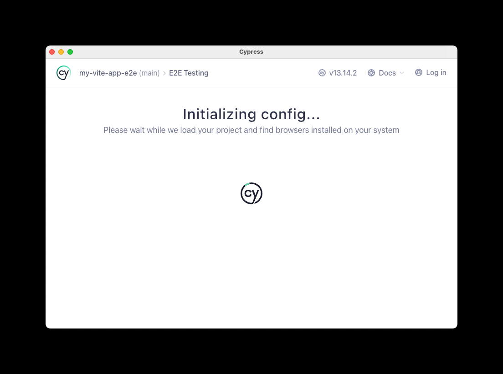

# TestNxCypressHttps

NX Integrated monorepo using pnpm

## Error description

After adding SSL certificates to vite config and changing URLs to https://localhost, when running `nx run my-vite-app-e2e:open-cypress` and selecting **E2E Testing**, I'm getting a time out error in the cypress app while "Initializing config...". When pressing **try again**, it works.

## Plugins

- @nx/web
- @nx/cypress
- @nx/vite

## SSL

certificates in my-vite-app/certs.

Create certificates with mkcert:

```
mkcert localhost 127.0.0.1 ::1
```

## Screenshot


